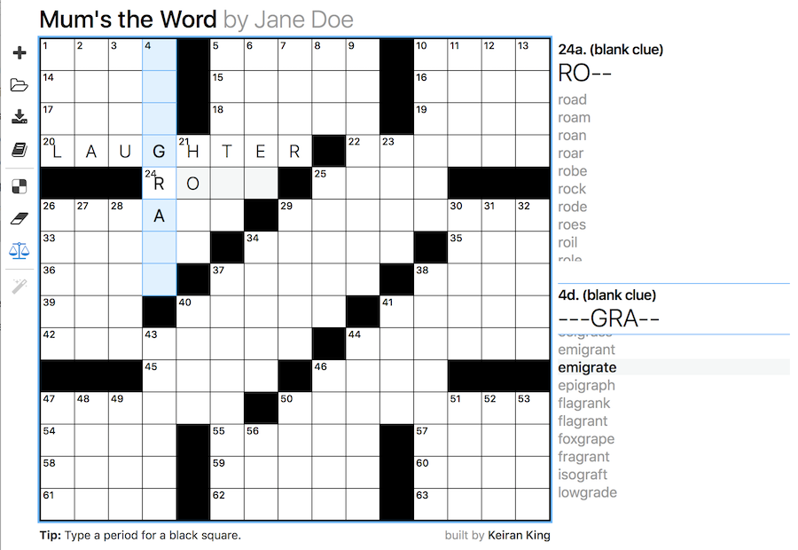

Fill, a crossword maker
=========================

Fill is a web app for making crosswords. 

* Reads and writes .xw files, which are just [JSON puzzle](https://www.xwordinfo.com/JSON/) files by another name.
* Use the built-in Merriam-Webster dictionary, or any other text file.