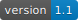
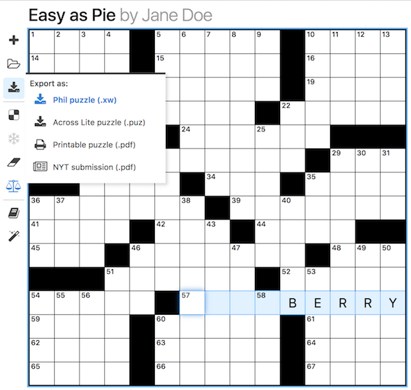

# Phil, a crossword maker

Phil helps you make crosswords, using client-side JavaScript.
* Open and save .xw files ([JSON puzzle files](https://www.xwordinfo.com/JSON/) by another name).
* Use the built-in Merriam-Webster dictionary, or any text file you want.
* Print to PDF.
* Create a New York Times submission in seconds.

## Related Resources

Phil uses [Font Awesome](https://github.com/FortAwesome/Font-Awesome/) icons and [jsPDF](https://github.com/MrRio/jsPDF/) (along with [jsPDF-AutoTable](https://github.com/simonbengtsson/jsPDF-AutoTable/)) for generating PDFs.

### Crosswords

* [Wordlists](http://www.puzzlers.org/dokuwiki/doku.php?id=solving:wordlists:about:start)
* [Crossword theme categories](http://www.cruciverb.com/index.php?action=ezportal;sa=page;p=70)
* [OneLook dictionary](http://onelook.com/)
